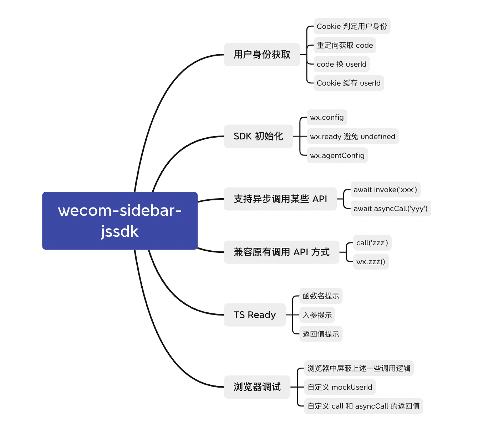
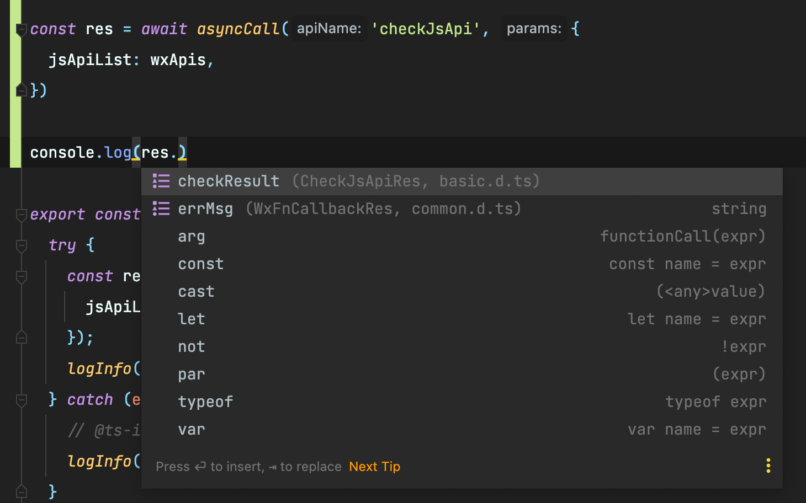

# wecom-sidebar-jssdk

更高抽象的企业微信 JS-SDK 封装。

## 安装

```shell
npm i wecom-sidebar-jssdk
```

## 简单上手

```ts
import {checkRedirect, initSdk, invoke, asyncCall, call} from 'wecom-sidebar-jssdk';

// 侧边栏配置
const config = {
  // 在 https://work.weixin.qq.com/wework_admin/frame#profile 这里可以找到
  corpId: 'xxx',
  // 在 https://work.weixin.qq.com/wework_admin/frame#apps 里的自建应用里可以找到
  agentId: 'yyy'
}

// 获取签名
export const fetchSignatures = async () => {
  const response = await axios.request<SignRes>({
    method: 'GET',
    url: '/signatures',
    params: {
      url: window.location.href
    }
  })

  return response.data;
}

// code 换取用户身份
const fetchUserId = async (code: string): Promise<string> => {
  const response = await axios.request({
    method: 'GET',
    url: '/user',
    params: {code}
  });
  return response.data.userId;
}

const render = () => {
  // 渲染 App
}

const testApi = async () => {
  try {
    // 获取外部联系人 external_user_id
    const res1 = await invoke('getCurExternalContact');
    console.log(res1.userId);

    // 拍照或从手机相册中选图接口
    const res2 = await asyncCall('chooseImage');
    console.log(res2.localIds);

    // 设置监听
    call('onNetworkStatusChange', (res) => {
      console.log(res.isConnected)
      console.log(res.networkType)
    })
  } catch (e) {
    console.log(e.message);
  }

  // 支持原始调用方式
  wx.invoke('getCurExternalContact', {}, function (res) {
    if (res.err_msg == "getCurExternalContact:ok") {
      userId = res.userId; //返回当前外部联系人userId
    } else {
      //错误处理
    }
  });
}

checkRedirect(config, fetchUserId)
  .then(() => initSdk(config, fetchSignatures))
  .then(() => testApi)
  .catch(() => console.error('JS-SDK 初始化失败'))
  .finally(() => render());
```

## 为什么

原始的侧边栏 JS-SDK 无论在调用体验、开发体验、TS 支持等都非常不好，所以希望再做一层抽象与封装来提升开发体验。

提供以下功能：



## TS Ready

所有 API 都配有 TypeScript 支持！

比如，提供 `apiName` 的 TS 类型支持：

;

提供入参的 TS 类型支持。

;

提供返回值的 TS 类型支持。

;

同时，对原来的 `wx` 变量也做了大量 TS 类型支持：


所以说，即使下面我提供的 API 都不能帮到你，那至少这个库的 TS 也能给你一个很好的开发体验。

## 工具 API

主要提供两个 API，负责获取用户身份以及初始化 JS-SDK。

### checkRedirect

检查是否需要重定向，并自动获取 `userId`，缓存到 Cookie 的函数。

```ts
import {checkRedirect} from 'wecom-sidebar-jssdk';

// 侧边栏配置
const config = {
  // 在 https://work.weixin.qq.com/wework_admin/frame#profile 这里可以找到
  corpId: 'xxx',
  // 在 https://work.weixin.qq.com/wework_admin/frame#apps 里的自建应用里可以找到
  agentId: 'yyy'
}

// code 换取用户身份
const fetchUserId = async (code: string): Promise<string> => {
  const response = await axios.request({
    method: 'GET',
    url: '/user',
    params: {code}
  });
  return response.data.userId;
}

await checkRedirect(config, fetchUserId)
```

| 参数        | 描述                         | 类型                                  |
|-----------|----------------------------|-------------------------------------|
| config    | 侧边栏基础配置                    | { corpId: string; agentId: string}  |
| getUserId | 远程用 `code` 获取 `userId` 的方法 | (code: string) => Promise<string> } |

### initSdk

初始化 JS-SDK 的重要方法！自动包含了 `wx.config`，`wx.ready`，`wx.agentConfig` 的逻辑，并支持 Promise 异步，帮你一步到位初始化。

```ts
import {initSdk, SignRes} from "wecom-sidebar-jssdk";

// 侧边栏配置
const config = {
  // 在 https://work.weixin.qq.com/wework_admin/frame#profile 这里可以找到
  corpId: 'xxx',
  // 在 https://work.weixin.qq.com/wework_admin/frame#apps 里的自建应用里可以找到
  agentId: 'yyy'
}

// interface SignRes {
//   meta: {
//     nonceStr: string,
//     timestamp: number,
//     url: string,
//   },
//   app: {
//     signature: string, // 应用 jsapi_ticket 生成的签名
//   },
//   corp: {
//     signature: string, // 企业的 jsapi_ticket 生成的签名
//   },
// }

// 获取签名
export const fetchSignatures = async () => {
  const response = await axios.request<SignRes>({
    method: 'GET',
    url: '/signatures',
    params: {
      url: window.location.href
    }
  })

  return response.data;
}

await initSdk(config, fetchSignatures);
```

| 参数              | 描述                                            | 类型                                 |
|-----------------|-----------------------------------------------|------------------------------------|
| config          | 侧边栏基础配置                                       | { corpId: string; agentId: string} |
| fetchSignatures | 远程获取企业和应用的生成的签名以及 `noncwStr` 和 `timetamp` 的方法 | () => Promise<SignRes> }           |

此方法最好放在 `checkRedirect` 之后调用，不然会出现 `WxBridge` 找不到的问题。

## SDK API

主要提供 3 个 API，对已有的的 `wx.fn` 和 `wx.invoke('xxx')` 进行封装，功能有：

* TS 完美提示，包括调用 API 名、入参和出参
* 支持 Promise 异步调用，你可以直接写 async/await 语法，避免回调地狱

### asyncCall

异步 `wx.fn` 的函数。比如：

以前你这么写：

```js
wx.checkJsApi({
  jsApiList: ['chooseImage'], // 需要检测的JS接口列表
  success: function (res) {
    // 以键值对的形式返回，可用的api值true，不可用为false
    // 如：{"checkResult":{"chooseImage":true},"errMsg":"checkJsApi:ok"}
  }
});
```

现在可以这么写：

```js
import {asyncCall} from 'wecom-sidebar-jssdk';

const res = await asyncCall({
  jsApiList: ['chooseImage']
})

console.log(res.checkResult);
```

只要 `wx.fn` 里需要传 `success` 的，都可以使用 `asyncCall` 来直接调用。

下面是调用参数

| 参数      | 描述                      | 类型     |
|---------|-------------------------|--------|
| apiName | `wx.fn` 的 fn 名          | string |
| params  | `wx.fn` 调用时的参数（不需要传回调了） | {}     |

返回参数为 `success` 回调时的参数。

失败时，会直接抛出 `errMsg.msg` 的内容，可通过 `console.log(e.message)` 查看。

### call

同步 `wx.fn` 的调用方式。因为某些接口调用是不需要异步等结果的，所以这个 API 和原来的 `wx.fn` 调用没什么差别，只不过会有更好的 TS 提示：

以前写法：

```js
wx.startRecord();
```

现在写法：

```js
import {call} from 'wecom-sidebar-jssdk';

call('startRecord');
```

下面是调用参数

| 参数      | 描述                      | 类型     |
|---------|-------------------------|--------|
| apiName | `wx.fn` 的 fn 名          | string |
| params  | `wx.fn` 调用时的参数（不需要传回调了） | {}     |

### invoke

调用 `wx.invoke('xxx')` 方法，这应该是用的最多的一种方法了，可以直接使用 async/await 的 Promise 来异步调用。

以前写法：

```js
wx.invoke('getCurExternalContact', {}, function (res) {
  if (res.err_msg == "getCurExternalContact:ok") {
    userId = res.userId; //返回当前外部联系人userId
  } else {
    //错误处理
  }
});
```

现在写法：

```js
import {invoke} from 'wecom-sidebar-jssdk';

const res = await invoke('getCurExternalContact', {});

console.log(res.userId);
```

下面是调用参数：

| 参数      | 描述                         | 类型     |
|---------|----------------------------|--------|
| apiName | `wx.invoke('xxx')` 的 xxx 名 | string |
| params  | `wx.invoke('xxx')` 调用时的参数  | {}     |

返回值为 `wx.invoke('xxx', callback)` 里 callback 的结果。

失败时，会抛出 `res.err_msg` 的内容，可通过 `console.log(e.message)` 查看。

## Mock API

使用 `wecom-sidebar-jssdk` 后可直接在浏览器上直接调试你的应用。

它的实现原理是将前面的一些调用方法都自动屏蔽了，也可以说是 Mock 掉。由于 SDK 是可以 Mock 的， 那么我也留了一个入口给大家，可以 Mock `wx.fn` 和 `wx.invoke` 的不同返回值。

下面都是一些相关的 Setter 操作。

### setIsMock

设置当前是否要 Mock JS-SDK，Mock 之后，应用将会：

* 不再走重定向用 `code` 换 `userId`，而是直接使用 `window._mockUserId` 这个值
* 调用上面 SDK 的 API 时，默认会 `console.log` 当前的入参和出参
* 当发现你自己有写返回的 Mock 值/函数时，自动执行 Mock 函数，或返回 Mock 值

`wecom-sidebar-jssdk` 会自动通过 `navigator.userAgent` 来判定当前是否为侧边栏环境来启动 Mock 环境，
`setIsMock` 只作为一种手动 toggle Mock 环境的方法：

```js
import {setIsMock} from 'wecom-sidebar-jssdk';

setIsMock(true) // 开启 Mock 环境

setIsMock(false) // 关闭 Mock 环境
```

当然你直接 `window._isMock = true/false` 来设置也是可以的。

### setMockUserId

在 Mock 环境下，自动读取 `window._mockUserId` 值，此方法为设置该值：

```js
import {setMockUserId} from 'wecom-sidebar-jssdk';

setMockUserId('xiaoming');
```

当然你直接 `window._mockUserId = 'xxx'` 来设置也是可以的。

### setWxResMock

在 Mock 环境下，当调用 `asyncCall` 或 `call` 时，自动 `window._wxResMock` 里拿 mock value 作为返回值，如果 mock function， 则会直接执行并返回。

使用示例：

```js
import {setWxResMock} from 'wecom-sidebar-jssdk';

wxResMock = {
  agentConfig: () => {
    console.log('mock agent config')
    return 'hello';
  },
  startRecord: 'ok'
}

setWxResMock(wxResMock) // 设置 mock

const hello = await asyncCall('agentConfig', config); // 打印 mock agent config，并返回 'hello'
const ok = call('startRecord') // 返回 'ok'
```

当然你直接 `window._wxResMock = { ... }` 来设置也是可以的。

### setInvokeResMock

在 Mock 环境下，当调用 `invoke` 时，自动 `window._invokeResMock` 里拿 mock value 作为返回值，如果为 mock function， 则会直接执行并返回。

使用示例：

```js
import {setInvokeResMock} from 'wecom-sidebar-jssdk';

const invokeResMock = {
  'getCurExternalContact': {
    userId: 'xxx'
  },
  'openUserProfile': 'yyy'
}

setInvokeResMock(invokeResMock) // 设置 mock

await invoke('getCurExternalContact'); // 返回 { userId: 'xxx' }
await invoke('openUserProfile', {...}) // 返回 'yyy'
```

当然你直接 `window._invokeResMock = { ... }` 来设置也是可以的。
